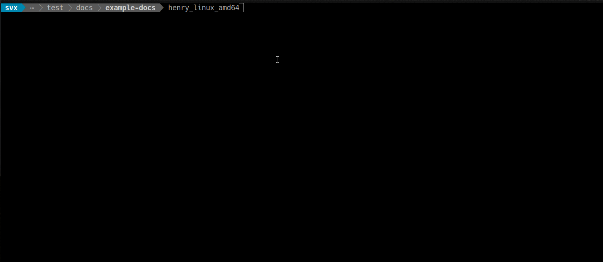
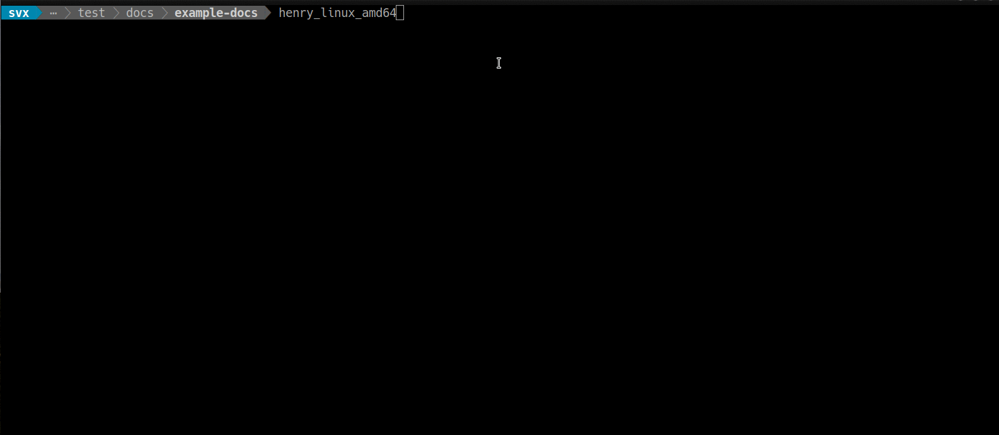

===================================
Henry - Documentation - Test Builds
===================================

A wrapper written in `Golang <https://golang.org/>`_ around `Sphinx <http://www.sphinx-doc.org/en/stable/>`_ and `Docker <https://www.docker.com/>`_.

.. sidebar:: Overview

   :Version: 0.0.1-alpha.2
   :Status: Work In Progress
   :Release: No stable release, yet
   :Dependencies: `Docker <https://www.docker.com/>`_

.. toctree::
   :maxdepth: 2
   :hidden:
   :caption: Henry

   about
   usage
   release-notes

.. toctree::
   :maxdepth: 2
   :hidden:
   :caption: Contributing

   development/index

If you don't want to deal with installing `Sphinx <http://www.sphinx-doc.org/en/stable/>`_ over and over again ....

No messing with virtualenv, pip, etc.

Henry can help you getting a quick visual how your docs will look like.

Features
========

- Builds HTML (default)
- Builds HTML in debug mode (reST checks)

.. note::

   Henry evolved out of the `Plone documentation project <https://docs.plone.org>`_.

   For the moment there is no 'easy' way to use your own theme or add-ons !

   This **will** change in the future !!

Examples
========

Command line

HTML Mode

Debug Mode

.. image:: _static/henry-debug.gif
   :alt: Henry debug mode
